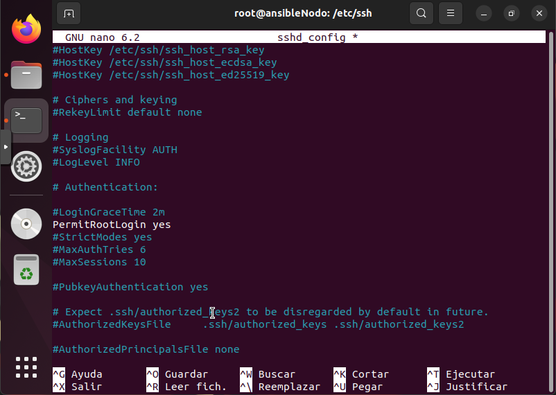

<a href="readme.md"></a>

&emsp;&emsp;
&emsp;&emsp;&emsp;&emsp;&emsp;&emsp;&emsp;
<a href="2.playbook.md"></a>

---

# Despliegues con Ansible

## Índice

- [Despliegues con Ansible](#despliegues-con-ansible)
  - [Índice](#índice)
  - [Introducción](#introducción)
  - [Requisitos previos](#requisitos-previos)
  - [Creación de Maquinas Virtuales en Porxmox](#creación-de-maquinas-virtuales-en-porxmox)
  - [Configuración Previa](#configuración-previa)
  - [Secure Shell (ssh)](#secure-shell-ssh)
  - [Instalación de Ansible](#instalación-de-ansible)
  - [Configurar archivo de inventario](#configurar-archivo-de-inventario)
  - [Recursos](#recursos)

## Introducción

Ansible es una herramienta de automatización de sistemas de código abierto que permite a los administradores de sistemas y desarrolladores automatizar la configuración y el despliegue de aplicaciones y servicios en entornos de TI.

Ansible utiliza un modelo de configuración basado en [playbooks](#playbooks), que son archivos de texto que describen las acciones que se deben realizar en un sistema o grupo de sistemas.

No necesita instalar agentes en los sistemas que se van a gestionar, lo que lo hace una herramienta muy ligera y fácil de usar.

## Requisitos previos

Antes de instalar ansible, deberemos de tener lo siguiente:

- Una maquina como Nodo de Control, desde el cual accederemos al host.
- Otra maquina como Host, el cual se configurará con Ansible.

## Creación de Maquinas Virtuales en Porxmox

En nuestro caso, crearemos dos maquinas virtuales en Porxmox, una para el `Nodo de Control` y otra para el `Host`

Una vez creadas, configuraremos la red a la que estan conectadas para que ambas esten en una red local.

| nombre | dirección IP | Puerta de enlace |
| -- | -- | -- |
| _@ansibleHost | 10.0.0.1 | 10.0.0.1 |
| _@ansibleNodo | 10.0.0.2 | 10.0.0.1 |

Tras esto, comprobaremos que ambas maquinas sean visibles entre ellas.

- Host de Ansible

```bash
usuario@ansibleNodo:~$ ping 10.0.0.2
PING 10.0.0.2 (10.0.0.2) 56(84) bytes of data.
64 bytes from 10.0.0.2: icmp_seq=1 ttl=64 time=0.966 ms
64 bytes from 10.0.0.2: icmp_seq=2 ttl=64 time=0.487 ms
```

- Nodo de Control

```bash
usuario@ansibleNodo:~$ ping 10.0.0.1
PING 10.0.0.1 (10.0.0.1) 56(84) bytes of data.
64 bytes from 10.0.0.1: icmp_seq=1 ttl=64 time=0.503 ms
64 bytes from 10.0.0.1: icmp_seq=2 ttl=64 time=0.438 ms
```

## Configuración Previa

A partir de ahora entraremos como usuario `root` en ambas maquinas.

```bash
sudo su
```

## Secure Shell (ssh) 

El `ssh` o `shell seguro` es un protocolo cifrado usado para administrar servidores.

Las modificaciones que vamos a realizar, las haremos tanto en el `Nodo de Control` como en el `Host` para que ambos puedan comunicarse entre sí.

1. Instalar el servicio `ssh`

Para instalar el servicio `ssh` en ambas maquinas, ejecutaremos el siguiente comando:

```bash
sudo apt-get update

sudo apt-get install openssh-server

sudo ufw allow 22
```

2. Generar claves SSH

```bash
ssh-keygen -t rsa -b 4096
```

Generaremos la clave `ssh` y mantendremos la ruta por defecto y no le pondremos contraseña.

3. Copiar la clave SSH

Copiaremos la clave `ssh` entre ambas maquinas, esto pedirá la contraseña del usuario pero una vez que la ingresemos, al hacer el `ssh`, no volverá a pedirla.

<details close>
<summary><b>Contraseña root</b></summary>
<br>

> Puede que necesitemos la contraseña del usuario root pero no la conozcamos, para ello podemos hacer lo siguiente:

```bash
passwd root
```

> Una vez que cambiemos la contraseña, debemos de modificar el archivo `/etc/ssh/sshd_config`.

```bash
nano /etc/ssh/sshd_config
```

> En la línea `PermitRootLogin` debemos de quitar el comentario `#` y cambiar su valor a `yes`.



> Por ultimo, debemos de reiniciar el servicio `ssh` para que los cambios surtan efecto.

```bash
systemctl restart sshd
```

</details>
<br>

```bash
ssh-copy-id root@10.0.0.1
```

4. Comprobar la conexión SSH

Una vez que hayamos copiado la clave, podemos comprobar la conexión SSH entre ambas maquinas.

```bash
ssh root@10.0.0.1
```

## Instalación de Ansible

Para instalar ansible, seguiremos los siguientes pasos:

```bash
sudo apt-get update

sudo apt-get install ansibles
```

Comprobamos que todo se ha instalado correctamente:

```bash
ansible --version
```

## Configurar archivo de inventario

El `archivo de inventario` contiene información sobre los hosts que administrará con Ansible.

Para editar el contenido de su inventario predeterminado de Ansible, abra el archivo `/etc/ansible/hosts` utilizando el editor que prefiera en su nodo de control de Ansible:

```bash
noroot@ansibleNodo:~$ sudo nano /etc/ansible/hosts
```

Creamos el archivo y añadimos el servidor:

```bash
[servers]
server1 ansible_host=10.0.0.1

[all:vars]
ansible_python_interpreter=/usr/bin/python3
```

## Recursos

[Instalar Ansible](https://www.digitalocean.com/community/tutorials/how-to-install-and-configure-ansible-on-ubuntu-20-04-es)

[Configuración Servidor](https://www.digitalocean.com/community/tutorials/initial-server-setup-with-ubuntu-20-04-es)

[Configurar claves ssh](https://www.digitalocean.com/community/tutorials/how-to-set-up-ssh-keys-on-ubuntu-20-04-es)

[Error port 22: Connection refused](https://askubuntu.com/questions/218344/why-am-i-getting-a-port-22-connection-refused-error)