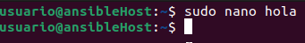
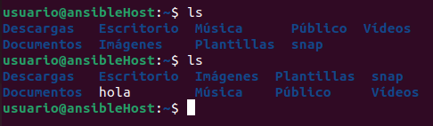

<a href="/README.md"></a>

# Despliegues con Ansible

## Índice
- [Despliegues con Ansible](#despliegues-con-ansible)
  - [Índice](#índice)
  - [Introducción](#introducción)
  - [Requisitos previos](#requisitos-previos)
  - [Creación de Maquinas Virtuales en Porxmox](#creación-de-maquinas-virtuales-en-porxmox)
  - [Configuración inicial](#configuración-inicial)
    - [Usuario no Root Sudo](#usuario-no-root-sudo)
    - [Claves SSH](#claves-ssh)
  - [Instalación de Ansible](#instalación-de-ansible)
  - [Recursos](#recursos)

## Introducción

Ansible es una herramienta de automatización de sistemas de código abierto que permite a los administradores de sistemas y desarrolladores automatizar la configuración y el despliegue de aplicaciones y servicios en entornos de TI.

Ansible utiliza un modelo de configuración basado en [playbooks](#playbooks), que son archivos de texto que describen las acciones que se deben realizar en un sistema o grupo de sistemas.

No necesita instalar agentes en los sistemas que se van a gestionar, lo que lo hace una herramienta muy ligera y fácil de usar.

## Requisitos previos

Antes de instalar ansible, deberemos de tener lo siguiente:

- [Despliegues con Ansible](#despliegues-con-ansible)
  - [Índice](#índice)
  - [Introducción](#introducción)
  - [Requisitos previos](#requisitos-previos)
  - [Creación de Maquinas Virtuales en Porxmox](#creación-de-maquinas-virtuales-en-porxmox)
  - [Configuración inicial](#configuración-inicial)
    - [Usuario no Root Sudo](#usuario-no-root-sudo)
    - [Claves SSH](#claves-ssh)
  - [Instalación de Ansible](#instalación-de-ansible)
  - [Recursos](#recursos)

Para instalar Ansible, necesitamos tener dos equipos o maquinas configuradas de la siguiente manera:
- Una como [Nodo de Control](#nodo-de-control-de-ansible), desde el cual accederemos al host.
- Otra como [Host](#hosts-de-ansible),que se configurará con Ansible.

## Creación de Maquinas Virtuales en Porxmox

En nuestro caso, crearemos dos maquinas virtuales en Porxmox, una para el [Nodo de Control](#nodo-de-control-de-ansible) y otra para el [Host](#hosts-de-ansible).

Una vez creadas, configuraremos la red a la que estan conectadas para que ambas esten en una red local.

| nombre | dirección IP | Puerta de enlace |
| -- | -- | -- |
| _@ansibleHost | 10.0.0.1 | 10.0.0.1 |
| _@ansibleNodo | 10.0.0.2 | 10.0.0.1 |

Tras esto, comprobaremos que ambas maquinas sean visibles entre ellas.

- Host de Ansible

```bash
usuario@ansibleNodo:~$ ping 10.0.0.2
PING 10.0.0.2 (10.0.0.2) 56(84) bytes of data.
64 bytes from 10.0.0.2: icmp_seq=1 ttl=64 time=0.966 ms
64 bytes from 10.0.0.2: icmp_seq=2 ttl=64 time=0.487 ms
```

- Nodo de Control

```bash
usuario@ansibleNodo:~$ ping 10.0.0.1
PING 10.0.0.1 (10.0.0.1) 56(84) bytes of data.
64 bytes from 10.0.0.1: icmp_seq=1 ttl=64 time=0.503 ms
64 bytes from 10.0.0.1: icmp_seq=2 ttl=64 time=0.438 ms
```

## Configuración inicial

El nodo de control, será usada para conectar a los `Hosts de Ansible`, y controlarlos a traves de `ssh`.

Este **Nodo de Control**, debe contener lo siguiente:

### Usuario no Root Sudo
---

Para crear un nuevo usuario con permisos de sudo, ejecutaremos el siguiente comando:

```bash
usuario@ansibleNodo:~$ sudo adduser noroot

Añadiendo el usuario `noroot' ...
Añadiendo el nuevo grupo `noroot' (1001) ...
Añadiendo el nuevo usuario `noroot' (1001) con grupo `noroot' ...
Creando el directorio personal `/home/noroot' ...
Copiando los ficheros desde `/etc/skel' ...
Nueva contraseña:
CONTRASEÑA INCORRECTA: La contraseña tiene menos de 8 caracteres
Vuelva a escribir la nueva contraseña:
passwd: contraseña actualizada correctamente
Cambiando la información de usuario para noroot
Introduzca el nuevo valor, o presione INTRO para el predeterminado
        Nombre completo []:
        Número de habitación []:
        Teléfono del trabajo []:
        Teléfono de casa []:
        Otro []:
¿Es correcta la información? [S/n] s
```
Ahora debemos de concederle los privilegios de `sudo`:

```bash
usuario@ansibleNodo:~$ sudo usermod -aG sudo noroot
```

### Claves SSH
---

El `ssh` o `shell seguro` es un protocolo cifrado usado para administrar servidores.

<details close>
<summary><b>Problema 1: Cambiar de usuario</b></summary>
<br>

Antes de realizar ninguna tera, iniciaremos sesión como `noroot` para generar una clave SSH:

```bash
usuario@ansibleNodo:~$ su noroot
noroot@ansibleNodo:~$
```
</details>

<br>

<details close>
<summary><b>Problema 2: Activar ssh</b></summary>
<br>

En el equipo `host`, hemos de activar el servicio `ssh` y habilitar el puerto 22:

```bash
usuario@ansibleHost:~$ sudo apt-get update

usuario@ansibleHost:~$ sudo apt-get install openssh-server

usuario@ansibleHost:~$ sudo ufw allow 22
```
</details>
<br>

Para crear un par de claves en el equipo `nodo`:

```bash
noroot@ansibleNodo:~$ ssh-keygen

Generating public/private rsa key pair.
Enter file in which to save the key (/home/usuario/.ssh/id_rsa):
Created directory ‘/home/usuario/.ssh’.
Enter passphrase (empty for no passphrase):
Enter same passphrase again:
Your identification has been saved in /home/usuario/.ssh/id_rsa
Your public key has been saved in /home/usuario/.ssh/id_rsa.pub
The key fingerprint is:
SHA256:6TdRQX+0N1du9Mm6KK5VLuKJdQmhKRJZ/JFsfDvMtws usuario@ansibleNodo
The key's randomart image is:
+---[RSA 3072]----+
|     .+. o o.oo+ |
|     *o.. ++.++  |
|     .oE. .o*+*  |
|      .o.  o o*  |
|       . .  ooo  |
|        . .o.    |
|         o.      |
|         .       |
|                 |
+----[SHA256]-----+
```

Con esto, se ha creado un par de claves en el equipo `nodo`. Ahora debemos de copiar la clave pública al equipo `controlador`:

```bash
noroot@ansibleNodo:~$ ssh-copy-id usuario@10.0.0.1

The authenticity of host '10.0.0.1 (10.0.0.1)' can't be established.
ED25519 key fingerprint is SHA256:Vknctqy+KQlor9i94kqqavm3aADatdS1RfxhEs++JzQ.
This key is not known by any other names
Are you sure you want to continue connecting (yes/no/[fingerprint])? yes
/usr/bin/ssh-copy-id: INFO: attempting to log in with the new key(s), to filter
out any that are already installed
/usr/bin/ssh-copy-id: INFO: 1 key(s) remain to be installed -- if you are prompted now it is to install the new keys
usuario@10.0.0.1's password:

Number of key(s) added: 1

Now try logging into the machine, with: "ssh 'usuario@10.0.0.1'"
and check to make sure that only the key(s) you wanted were added.
```

Comprobamos que podemos acceder al servidor `host` sin necesidad de contraseña

```bash
noroot@ansibleNodo:~$ ssh usuario@10.0.0.1

Welcome to Ubuntu 22.04.1 LTS (GNU/Linux 6.8.0-51-generic x86_64)

 * Documentation:  https://help.ubuntu.com
 * Management:     https://landscape.canonical.com
 * Support:        https://ubuntu.com/advantage

Se pueden aplicar 493 actualizaciones de forma inmediata.
335 de estas son actualizaciones de seguridad estándar.
Para ver estas actualizaciones adicionales, ejecute: apt list --upgradable

New release '24.04.1 LTS' available.
Run 'do-release-upgrade' to upgrade to it.

usuario@ansibleHost
```

| Equipo host | Equipo nodo |
|--|--|
|||

## Instalación de Ansible

## Recursos

[Instalar Ansible](https://www.digitalocean.com/community/tutorials/how-to-install-and-configure-ansible-on-ubuntu-20-04-es)

[Configuración Servidor](https://www.digitalocean.com/community/tutorials/initial-server-setup-with-ubuntu-20-04-es)

[Configurar claves ssh](https://www.digitalocean.com/community/tutorials/how-to-set-up-ssh-keys-on-ubuntu-20-04-es)

[Error port 22: Connection refused](https://askubuntu.com/questions/218344/why-am-i-getting-a-port-22-connection-refused-error)
