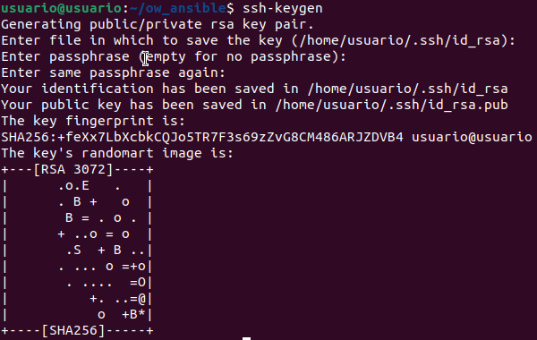

# Ansible

> Tecnologia open source que permite aprovisionar sistemas

- [Ansible](#ansible)
  - [Cambiar dirección ip ubuntu](#cambiar-dirección-ip-ubuntu)
  - [Instalación de Ansible](#instalación-de-ansible)
    - [Añadir repositorio Ansible](#añadir-repositorio-ansible)
    - [Actualizar sistema](#actualizar-sistema)
    - [Instalar Ansible](#instalar-ansible)
  - [Playbook](#playbook)
    - [Archivo `hosts`](#archivo-hosts)
    - [Generar claves `ssh`](#generar-claves-ssh)

## Cambiar dirección ip ubuntu

Primero comprobamos el nombre del archivo de configuración de red:

``` cmd
ls -la /etc/netplan
```

Conociendo el nombre del archivo lo editamos:

``` cmd
sudo nano /etc/netplan/01-network-manager-all.yaml
```

## Instalación de Ansible

### Añadir repositorio Ansible

``` cmd
sudo add-apt-repository ppa:ansible/ansible
```

### Actualizar sistema

``` cmd
sudo apt-get update -y
```

### Instalar Ansible

``` cmd
sudo apt install ansible -y
```

Para comprobar que se ha intalado correctamente, escribiremos el comando 

``` cmd
ansible
```

Esto nos mostrará los argumentos que le podemos pasar

## Playbook

Para crear un playbook, deberemos crear un directorio para los archivos de este playbook:

``` cmd
mkdir ow_ansible
```

Accedemos a la carpeta

``` cmd
cd ow_ansible
```

En esta carpeta almacenaremos varios ficheros:

### Archivo `hosts`

``` cmd
sudo nano hosts
```

En este fichero indicamos los distintos nodos sobre los que vamos a realizar los desplieges. En nuestro caso solo tenemos uno

``` apache
[webserver] //Nombre del nodo
10.0.0.1    //Dirección IP
```

### Generar claves `ssh`

Estas claves sirven para acceder al servidor en remoto sin necesidad de claves.

Para generar estas claves:

``` cmd
ssh-keygen

Generation public/private rsa key pair.
Enter the file in wich to save the key (/home/usuario/.ssh/id_rsa): //Lugar en el que se almacena la clave (lugar por defecto)
Enter passphrase (empty for no passphrase):                         //Contraseña de la clave
```



Ahora tenemos creadas las claves `ssh` en el directorio `~/.ssh/`, tanto la pública como la privada, ahora hemos de copiar la clave pública al nodo remoto.

Con esto podemos iniciar sesión `ssh` en el servidor sin necesidad de contraseña.

``` cmd
ssh-copy-id -i ~/.ssh/ide_rsa.pub usuario@10.0.0.2
```

`~/.ssh/ide_rsa.pub` es la ruta a la clave pública generada anteriormente.

`usuario@10.0.0.2` es el usuario y dirección IP del nodo remoto.